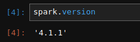
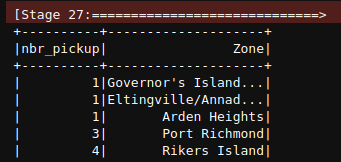

# Module 6 Homework

In this homework we'll put what we learned about Spark in practice.

For this homework we will be using the Yellow 2025-11 data from the official website:

```bash
wget https://d37ci6vzurychx.cloudfront.net/trip-data/yellow_tripdata_2025-11.parquet
```


## Question 1: Install Spark and PySpark

- Install Spark
- Run PySpark
- Create a local spark session
- Execute spark.version.

What's the output?

- [x] '4.1.1'



> [!NOTE]
> To install PySpark follow this [guide](https://github.com/DataTalksClub/data-engineering-zoomcamp/blob/main/06-batch/setup/)


## Question 2: Yellow November 2025

Read the November 2025 Yellow into a Spark Dataframe.

Repartition the Dataframe to 4 partitions and save it to parquet.

What is the average size of the Parquet (ending with .parquet extension) Files that were created (in MB)? Select the answer which most closely matches.

- 6MB
- 25MB
- 75MB
- [x] 100MB


```pyspark

df = spark.read.parquet(f'{gs_bucket}homework_M07/yellow_tripdata_2025-11.parquet')
df.repartition(4).write.mode("overwrite").parquet(f'{gs_bucket}homework_M07/yellow_2025_11_repartitioned/')
!ls -lh gs_bucket/homework_M07/yellow_2025_11_repartitioned/*.parquet

```

## Question 3: Count records

How many taxi trips were there on the 15th of November?

Consider only trips that started on the 15th of November.

- 62,610
- 102,340
- [x] 162,604
- 225,768

```pyspark

df.filter(F.to_date('tpep_pickup_datetime') == '2025-11-15').count()

```

*Output : * 162604


## Question 4: Longest trip

What is the length of the longest trip in the dataset in hours?

- 22.7
- 58.2
- 90.6
- 134.5

*SQL query :**
```sql

spark.sql("""
    SELECT 
        tpep_pickup_datetime,
        tpep_dropoff_datetime,
        (unix_timestamp(tpep_dropoff_datetime) - unix_timestamp(tpep_pickup_datetime)) / 3600 AS duration_hours
    FROM trips_data_11_2025
    ORDER BY duration_hours DESC
    LIMIT 5
""").show()

 ```

## Question 5: User Interface

Spark's User Interface which shows the application's dashboard runs on which local port?

- 80
- 443
- [x] 4040
- 8080


## Question 6: Least frequent pickup location zone

Load the zone lookup data into a temp view in Spark:

```bash
wget https://d37ci6vzurychx.cloudfront.net/misc/taxi_zone_lookup.csv
```

Using the zone lookup data and the Yellow November 2025 data, what is the name of the LEAST frequent pickup location Zone?

- [x] Governor's Island/Ellis Island/Liberty Island
- [x] Arden Heights
- Rikers Island
- Jamaica Bay

If multiple answers are correct, select any

*SQL query :**
```sql

spark.sql("""
SELECT 
    COUNT(*) AS nbr_pickup,
    z.Zone AS Zone
    
FROM trips_data_11_2025 t 
JOIN zones z
    ON t.PULocationID=z.LocationID
GROUP BY z.Zone
ORDER BY nbr_pickup
""").show()

 ```

 


```pyspark

df.join(df_zones, df['PULocationID'] == df_zones['LocationID'], 'inner') \
  .groupBy('Zone') \
  .agg(F.count('*').alias('nbr_pickup')) \
  .orderBy('nbr_pickup', ascending=True) \
  .show(5)

```

## Submitting the solutions

- Form for submitting: https://courses.datatalks.club/de-zoomcamp-2026/homework/hw6
- Deadline: See the website


## Learning in Public

We encourage everyone to share what they learned. This is called "learning in public".

Read more about the benefits [here](https://alexeyondata.substack.com/p/benefits-of-learning-in-public-and).

### Example post for LinkedIn

```
🚀 Week 6 of Data Engineering Zoomcamp by @DataTalksClub complete!

Just finished Module 6 - Batch Processing with Spark. Learned how to:

✅ Set up PySpark and create Spark sessions
✅ Read and process Parquet files at scale
✅ Repartition data for optimal performance
✅ Analyze millions of taxi trips with DataFrames
✅ Use Spark UI for monitoring jobs

Processing 4M+ taxi trips with Spark - distributed computing is powerful! 💪

Here's my homework solution: <LINK>

Following along with this amazing free course - who else is learning data engineering?

You can sign up here: https://github.com/DataTalksClub/data-engineering-zoomcamp/
```

### Example post for Twitter/X

```
⚡ Module 6 of Data Engineering Zoomcamp done!

- Batch processing with Spark 🔥
- PySpark & DataFrames
- Parquet file optimization
- Spark UI on port 4040

My solution: <LINK>

Free course by @DataTalksClub: https://github.com/DataTalksClub/data-engineering-zoomcamp/
```